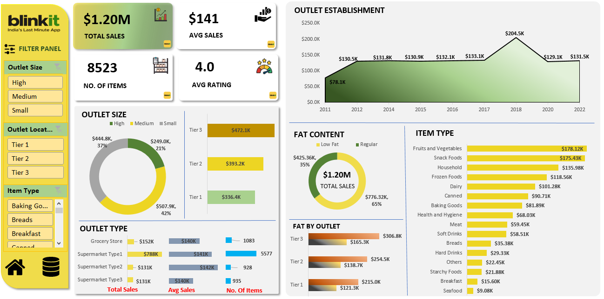
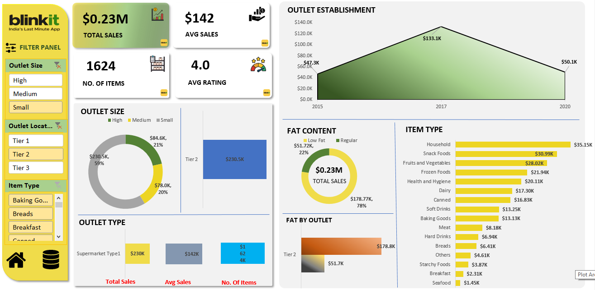
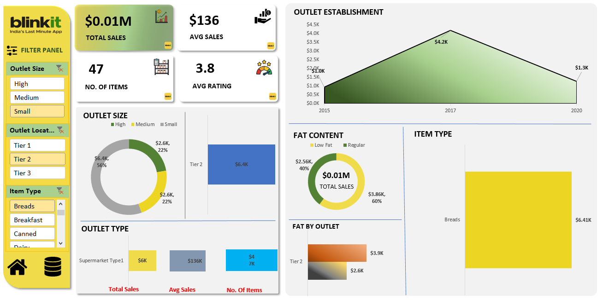
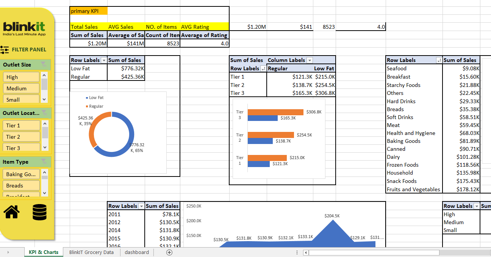
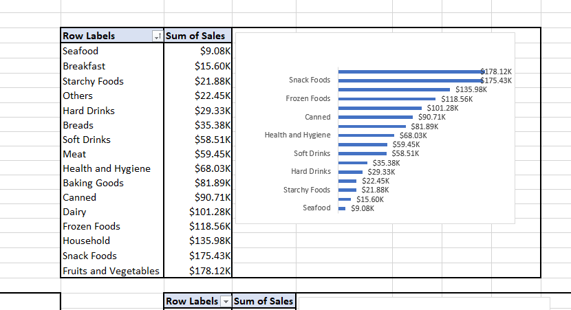
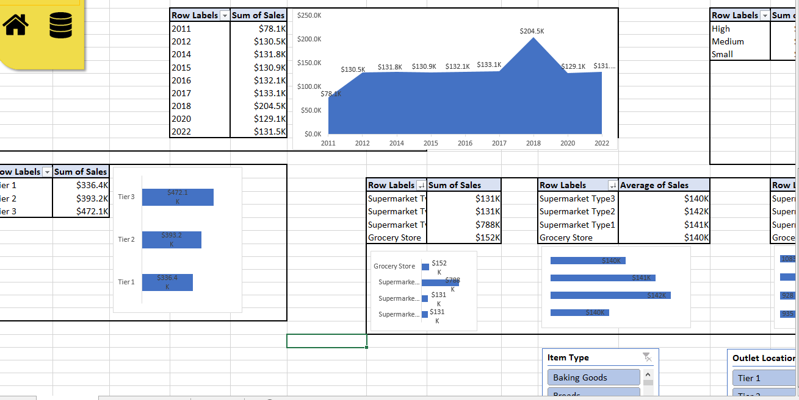
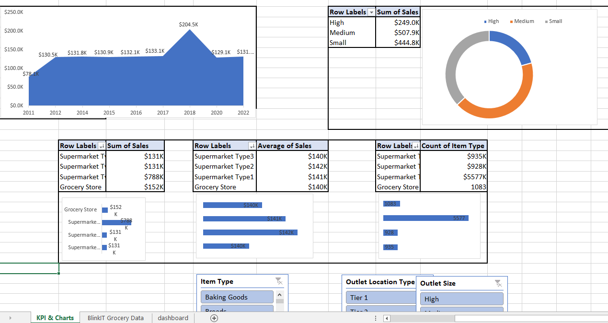

# 📊 Blinkit Sales Analysis Dashboard (Excel)

## 🔍 Problem Statement

In the quick-commerce industry, companies like Blinkit generate large volumes of sales data across multiple outlets, product categories, and customer segments. However, extracting meaningful insights from raw data is challenging.

This project focuses on building an interactive Excel dashboard to analyze sales performance, identify trends, and support data-driven decision-making.

---

## 🎯 Objectives

* Analyze overall sales performance
* Compare sales across outlet sizes, tiers, and types
* Identify top-performing product categories
* Understand customer preferences (fat content analysis)
* Track outlet establishment trends over time
* Enable interactive filtering for better insights

---

## 📁 Dataset

* Blinkit Grocery Dataset
* Contains information about:

  * Item Type
  * Outlet Size & Tier
  * Sales Data
  * Ratings
  * Fat Content

---

## 📊 Dashboard Features

* 💰 **Total Sales, Average Sales, Number of Items**
* 🏪 **Outlet Analysis (Size, Tier, Type)**
* 🥗 **Fat Content Distribution**
* 📈 **Outlet Establishment Trend**
* 🛒 **Item Type Performance**
* 🎛️ **Interactive Filter Panel**

---

## 🛠️ Tools & Techniques Used

* Microsoft Excel
* Pivot Tables
* Pivot Charts
* Slicers & Filters
* Data Cleaning
* Data Visualization

---

## 📊 Dashboard Preview

### 🔹 Main Dashboard

### 🔹 Filters Panel

### 🔹 KPI & Charts View

---

## 💡 Key Insights

* Tier 3 outlets generate the highest sales
* Fruits & Vegetables and Snack Foods are top-performing categories
* Regular fat products contribute more to total sales
* Sales saw a significant peak around 2018

---

## 🚀 How to Use

1. Download the Excel file
2. Open in Microsoft Excel
3. Use the filter panel to interact with the dashboard
4. Explore insights across different dimensions

---

## 📌 Project Learnings

* Improved data cleaning and transformation skills
* Gained hands-on experience with Excel dashboards
* Learned how to present data in a user-friendly way
* Developed business understanding through data analysis

---

## 🔗 Connect with Me

Feel free to connect on LinkedIn for feedback and collaboration!

---

⭐ If you found this project useful, don’t forget to star the repository!

